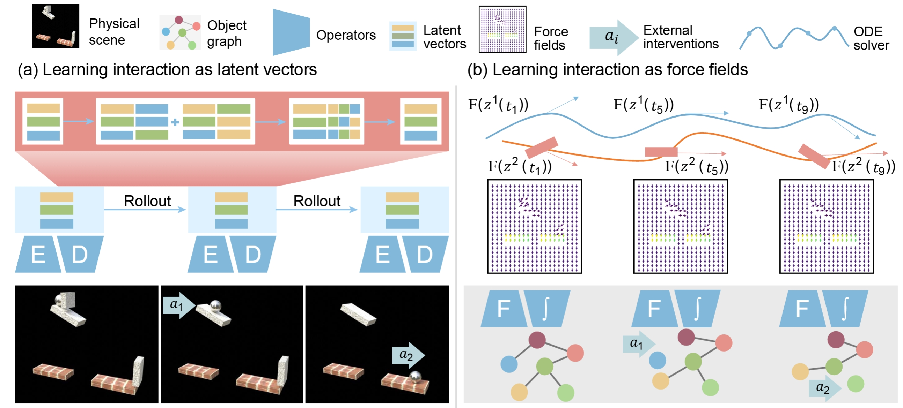

<h1 align="center"> Neural Force Field: Few-shot Learning of Generalized Physical Reasoning</h1>

<h3 align="center">ICLR 2026</h3>

<div align="center">
    <p>
        <a href="https://lishiqianhugh.github.io/">Shiqian Li</a><sup>*</sup>&nbsp;&nbsp;
        <a href="https://ruihong04.github.io/">Ruihong Shen</a><sup>*</sup>&nbsp;&nbsp;
        <a href="https://taoyaoyu.me/">Yaoyu Tao</a><sup>†</sup>&nbsp;&nbsp;
        <a href="http://wellyzhang.github.io/">Chi Zhang</a><sup>†</sup>&nbsp;&nbsp;
        <a href="https://yzhu.io/">Yixin Zhu</a><sup>†</sup>&nbsp;&nbsp;
    </p>
    <p>
        Peking University &nbsp;&nbsp;&nbsp;
    </p>
    <p>
        <sup>*</sup> Equal Contribution &nbsp;&nbsp;&nbsp;
        <sup>†</sup> Corresponding Author
    </p>
</div>


<p align="center">
    <a href='https://neuralforcefield.github.io/'>
        
    </a>
    <a href='https://arxiv.org/pdf/2502.08987'>
        
    </a>
    <a href='https://drive.google.com/file/d/1W5Nhi_rgxOFJ1kSaCY-1QaFJGG2oXobk/view?usp=sharing'>
        
    </a>
    <a href='https://drive.google.com/file/d/19cYptESkZJx2KgKL7Tm0oUajPmGCs_7B/view?usp=sharing'>
        
    </a>
    <a href='https://vimeo.com/1055247476'>
        
    </a>
</p>



## 📊 Project structure
```
NeuralForceField/
│
├── data/
│   └──iphyre/game_seq_data/
│       ├── activated_pendulum/
│       ├── angle/
│       ├── ...
│       └── support_hole/
│   └── nbody/
│       ├── train_data.npy
│       ├── val_data.npy
│       ├── within_data.npy
│       └── cross_data.npy
│
├── checkpoints/
│   └── nbody/
│       ├── nff/
│       ├── in/
│       ├── slotformer/
│       └── segno/
│           ├── model_best.pth
│           └── train_args.json
│   └── iphyre/
│
├── iphyre/             
│   ├── configs/         # Configuration files
│   ├── models/          # Model dir containing NFF, IN, SlotFormer
│   ├── utils/           # Useful tools such as dataloader
│   ├── planning.py      # Planning script
│   ├── README.md        # An instruction for use
│   ├── test.py          # Evaluation functions
│   └── train.py         # Training functions
│
├── iphyre/             
│   ├── configs/         # Configuration files
│   ├── models/          # Model dir containing NFF, IN, SlotFormer
│   ├── utils/           # Useful tools such as dataloader
│   ├── generate_data.py # Data generation functions
│   ├── planning.py      # Planning script
│   ├── README.md        # An instruction for use
│   ├── test.py          # Evaluation functions
│   └── train.py         # Training functions
```
## 🔧 Getting started
Make sure you have installed torch, torchdiffeq, iphyre, and rebound.

Go to the specific task directory to train and test the models. The instructions of running commands are provided for each task ([README_iphyre](./iphyre/README.md) and [README_nbody](./nbody/README.md)). Download data [here](https://drive.google.com/file/d/1n5P7RiK1V7LxRJW8mvLL-QeDzHF7d75O/view?usp=sharing) and checkpoin ts [here](https://drive.google.com/file/d/1q326zDuFwggRFjUI7ash_tr8PiHGSVZI/view?usp=sharing).
```
cd ./iphyre
```

or

```
cd ./nbody
```

## 🚀 Related Projects
* **[ICLR 2026] Learning Physics-Grounded 4D Dynamics with Neural Gaussian Force Fields**: Our latest approach extending NFF to video prediction and 3D deformable objects. [[Project Page](https://neuralgaussianforcefield.github.io/) | [Paper](https://arxiv.org/abs/2602.00148) | [Code](https://github.com/lishiqianhugh/NeuralGaussianForceField)]


## 📚 Citation
If you find our work helpful, please consider citing:
```bibtex
@inproceedings{
  li2026nff,
  title     = {Neural Force Field: Few-shot Learning of Generalized Physical Reasoning},
  author    = {Li, Shiqian and Shen, Ruihong and Tao, Yaoyu and Zhang, Chi and Zhu, Yixin},
  year      = {2026},
  booktitle = {ICLR},
  url       = {https://neuralforcefield.github.io/}
}
```
